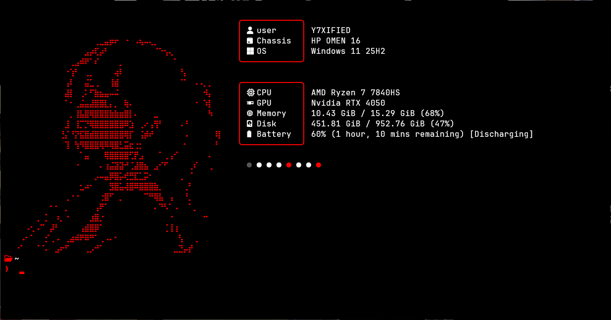

<h3 align="center"><b>TERMINAL DOTFILES</b></h3>

Welcome to my awesome, highly customized terminal dotfiles! These configurations turn a standard Windows PowerShell into an absolute powerhouse with gorgeous anime-inspired ASCII art, real-time system stats (CPU, GPU, RAM, Battery), and a totally immersive pitch-black aesthetic. Prepare to be wowed every time you open your terminal! ✨

## 🚀 Live Website
Experience the fully interactive website live here: [https://github.com/Y7XIFIED/Terminal-Dotfiles](https://github.com/Y7XIFIED/Terminal-Dotfiles)

## 📸 Preview

  

Y7XIFIED

